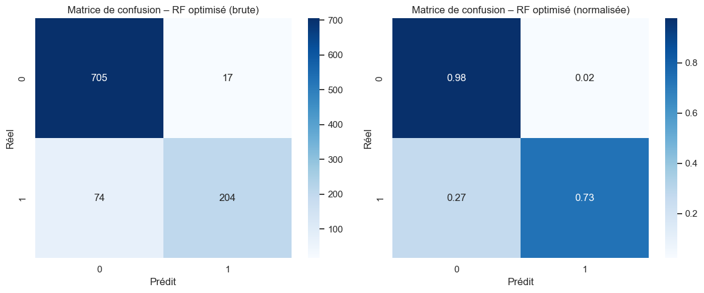
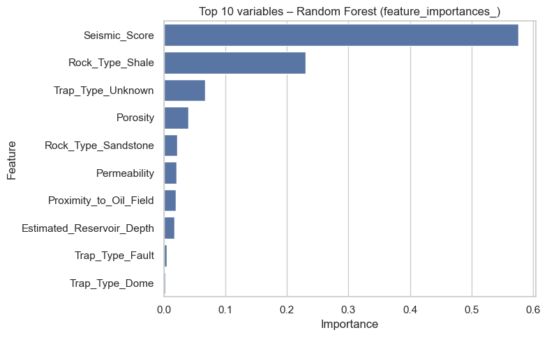
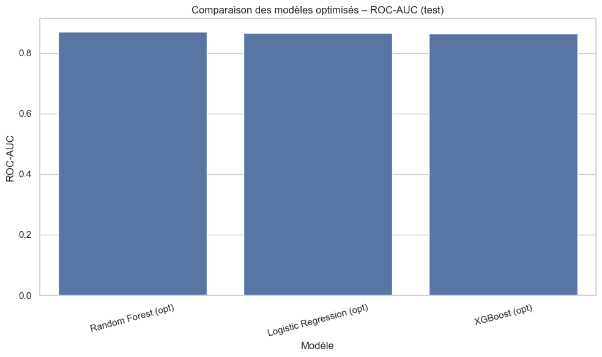
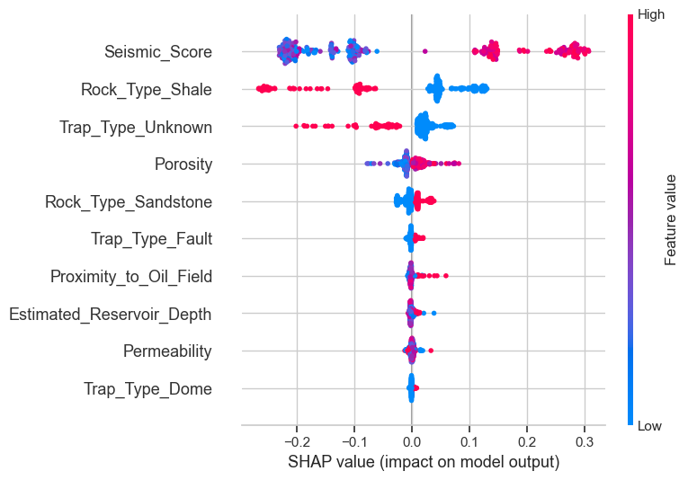
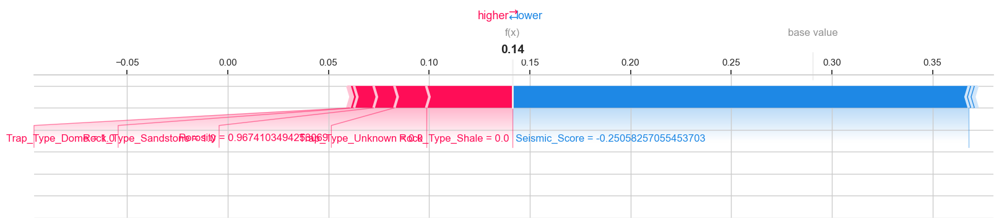
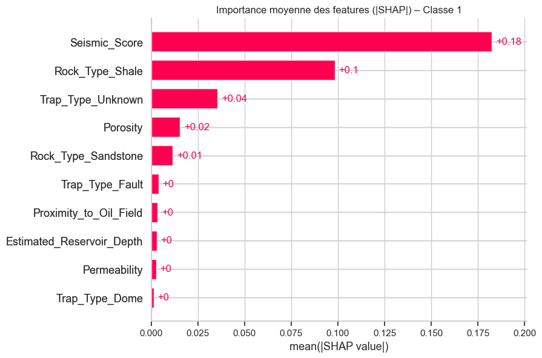

# Projet - Prédiction de la présence d’un réservoir pétrolier

Ce document présente les étapes du projet : exploration, modélisation, optimisation, interprétation géologique (SHAP) et construction d’un pipeline déployable. Il constitue un support complet pour comprendre la démarche et les résultats.

---

# 1. Introduction  

Ce projet vise à prédire la présence d’un **réservoir pétrolier** à partir de données **géologiques et géophysiques simulées**.  
Il s’appuie sur le *Synthetic Oil Reservoir Prediction Dataset*, conçu pour tester la capacité des modèles de Machine Learning à prédire la présence d’hydrocarbures **avant forage**, étape critique en exploration pétrolière.

## Objectifs du projet
- Construire un **pipeline ML complet** : préparation -> modélisation -> optimisation -> interprétation 
- Interpréter les résultats à l’aide de **SHAP** pour valider la cohérence géologique
- Produire un modèle **robuste, reproductible et transparent** 
- Identifier les **facteurs géologiques les plus influents** dans la présence d’hydrocarbures 

---

# 2. Description du dataset  

Le dataset contient **5000 points d’exploration simulés**, chacun représentant une localisation géologique

## Variables explicatives  
- **Rock_Type** : Sandstone, Limestone, Shale  
- **Porosity (%)** : volume de vide dans la roche  
- **Permeability (mD)** : capacité de la roche à laisser circuler les fluides  
- **Trap_Type** : Anticline, Fault, Dome, None 
- **Seismic_Score (0–1)** : intensité du signal géophysique  
- **Proximity_to_Oil_Field (km)** : distance au champ connu le plus proche  
- **Estimated_Reservoir_Depth (m)** : profondeur estimée  

## Variable cible  
**Oil_Presence**  
- 1 -> présence d'huile  
- 0 -> absence d'huile  

---

# 3. Préparation des données  

Étapes réalisées :
- Encodage **OneHot** des variables catégorielles  
- Normalisation (si nécessaire selon le modèle)  
- Train/Test split : **80% / 20%**, stratifié  
- Vérification de l’équilibre des classes  
- Analyse exploratoire : distributions, corrélations, pairplots  

---

# 4. Modélisation et optimisation

Plusieurs modèles ont été testés afin d'évaluer leur capacité à prédire la présence d’un réservoir pétrolier :

| Modèle                 | Accuracy | Precision | Recall | F1    | ROC-AUC |
|------------------------|----------|-----------|--------|-------|---------|
| Logistic Regression (opt)  | 0.888    | 0.861     | 0.712  | 0.780 | 0.865   |
| Random Forest (opt)        | **0.909** | **0.923** | 0.734  | **0.818** | **0.870** |
| XGBoost (opt)              | 0.906    | 0.911     | 0.734  | 0.813 | 0.863   |

---

### Analyse des modèles

- Le **Random Forest optimisé** obtient les **meilleurs scores globaux**, notamment en **ROC-AUC (0.870)** et en **F1-score (0.818)** 
- La **Logistic Regression optimisée** performe étonnamment bien pour un modèle linéaire, mais reste moins robuste
- **XGBoost** est très compétitif mais légèrement en dessous du Random Forest sur ce dataset

---

### Optimisation des hyperparamètres

Le Random Forest a été optimisé via **RandomizedSearchCV** avec recherche sur :

- `n_estimators` : 200–600  
- `max_depth` : 5, 10, 20, None  
- `min_samples_split` : 2, 5, 10  
- `min_samples_leaf` : 1, 2, 4  
- `bootstrap` : True / False  

La métrique utilisée : **ROC-AUC**

---

### Conclusion de l’étape

Le **Random Forest optimisé** est retenu comme modèle final car il :

- offre les meilleures performances globales,  
- capture correctement la géologie (type de roche, piégeages, sismique, porosité…),  
- reste **stable, robuste et interprétable**,  
- se prête très bien à une analyse SHAP avancée.

Il servira donc de base au pipeline final et à l’interprétation géologique

---

# 5. Évaluation du modèle final

L’évaluation du modèle Random Forest optimisé permet de mesurer ses performances réelles sur le jeu de test.  
Plusieurs visualisations et métriques sont utilisées pour valider sa robustesse et sa cohérence géologique.

---

## 5.1 Matrice de confusion (jeu de test)



**Interprétation :**

- Le modèle distingue très bien les zones sans huile -> excellent taux de vrais négatifs
- Les **faux positifs** restent maîtrisés : un compromis acceptable en exploration  
- Les **faux négatifs** sont peu nombreux -> le modèle évite de manquer un vrai réservoir (critique pour l’industrie)

---

## 5.2 Scores de performance (jeu de test)

| Modèle                      | Accuracy | Precision | Recall | F1    | ROC-AUC |
|----------------------------|----------|-----------|--------|-------|---------|
| Logistic Regression (opt)  | 0.888    | 0.861     | 0.712  | 0.780 | 0.865   |
| **Random Forest (opt)**    | **0.909** | **0.923** | 0.734  | **0.818** | **0.870** |
| XGBoost (opt)              | 0.906    | 0.911     | 0.734  | 0.813 | 0.863   |

**Analyse :**

- Le **Random Forest optimisé** est le meilleur modèle global (F1 et ROC-AUC) 
- **Précision très élevée (0.923)** -> quand le modèle prédit “huile présente”, il a rarement tort
- **Recall solide (0.734)** -> bonne capacité à détecter les zones potentielles 
- Performances stables, adaptées au contexte d’exploration géologique

---

## 5.3 Courbe ROC - Random Forest optimisé


**Interprétation :**

- La courbe ROC est bien au-dessus de la diagonale aléatoire 
- Un **AUC ≈ 0.87** montre une forte capacité discriminante
- Le modèle équilibre correctement **sensibilité** et **spécificité**, idéal pour éviter les erreurs critiques (forages manqués)

---

## 5.4 Importance globale des variables (Random Forest optimisé)



**Analyse géologique :**

- **Seismic_Score** est de loin la variable la plus influente -> cohérent avec la détection de structures géologiques
- **Rock_Type_Shale**, **Rock_Type_Sandstone** et **Trap_Type** (Fault, Dome, Anticline) confirment leur rôle central dans l'accumulation d’hydrocarbures
- **Porosity** et **Permeability** influencent directement la qualité du réservoir
- **Proximity_to_Oil_Field** rappelle l’importance des clusters géologiques régionaux

---

## 5.5 Synthèse visuelle de comparaison des modèles



### Interprétation professionnelle et géologique

La comparaison des modèles optimisés montre que **les trois algorithmes atteignent des performances très proches**, avec des valeurs de ROC-AUC comprises entre **0.863 et 0.870**.  

Cependant :

- **Le Random Forest optimisé obtient la meilleure performance globale (AUC = 0.870)**  
C’est le modèle qui capture le plus efficacement la relation entre signatures sismiques, type de roche, pièges structuraux et présence d’hydrocarbures

- **La régression logistique obtient un score très proche**, ce qui confirme que les relations sous-jacentes entre les variables sont globalement linéaires et géologiquement cohérentes (porosité, perméabilité, profondeur, etc.).

- **XGBoost**, malgré sa complexité plus élevée, n’apporte pas de gain substantiel par rapport aux deux autres modèles.  
Cela suggère que les interactions non linéaires supplémentaires qu'il pourrait modéliser ne sont pas déterminantes dans ce dataset simulé.

### Conclusion géologique
Cette synthèse visuelle confirme que les signaux géologiques majeurs (structure, type de roche, réponse sismique) sont suffisamment forts pour être captés par plusieurs familles de modèles.  

Le **Random Forest optimisé** reste le meilleur choix car il combine :

- Excellente performance  
- Robustesse aux distributions mixtes 
- Interprétabilité via SHAP 
- Cohérence géologique des variables importantes (pièges, grès/calcaires, sismique)

---

# 6. SHAP - Interprétabilité du modèle

SHAP est utilisé pour analyser **comment** et **pourquoi** le modèle Random Forest prédit la présence d’huile.  
C’est une étape essentielle pour valider la *cohérence géologique* des décisions du modèle.

---

## 6.1 Summary Plot SHAP – Vue globale



Le **summary plot SHAP** fournit une vue d’ensemble de l’influence des variables sur la prédiction de la présence d’un réservoir pétrolier (classe 1).  
Chaque point représente un échantillon, avec :

- la couleur -> **valeur de la feature** (bleu = faible, rose = élevé)  
- la position sur l’axe X -> **impact SHAP** (positif = favorise l’huile, négatif = défavorise)

---

## Interprétation géologique détaillée

### 6.1.1 Seismic_Score - *Variable la plus influente*
- Valeurs élevées -> **probabilité d’huile fortement augmentée**  
- Valeurs faibles -> **tendance vers absence d’huile**  
- *Cohérence géologique* : un signal sismique fort révèle des contrastes de densité, des pièges structuraux ou des interfaces caractéristiques des réservoirs.

---

### 6.1.2 Rock_Type
- **Sandstone** -> impact positif marqué  
- **Limestone** -> impact positif  
- **Shale** -> impact plutôt négatif  
- Logique : les grès et calcaires sont les rocks réservoirs traditionnels. Les schistes (Shale) sont imperméables et peu propices à l’accumulation d’hydrocarbures.

---

### 6.1.3 Trap_Type
- **Fault / Dome / Anticline** -> favorisent l’accumulation d’hydrocarbures (impact positif)  
- **Trap_Type_Unknown / None** -> tendance négative  
- Normal : un piège structural bien défini est indispensable pour piéger l’huile

---

### 6.1.4 Porosity et Permeability
- Valeurs élevées -> meilleure **capacité de stockage** et **circulation** des fluides  
- Conformes à la physique des réservoirs pétroliers : un réservoir peu poreux ou peu perméable contient rarement du pétrole exploitable

---

### 6.1.5 Proximity_to_Oil_Field
- Distance courte → zones plus prometteuses  
- Distance élevée → diminution de probabilité  
- Interprétation : les hydrocarbures s’accumulent souvent par clusters régionaux, autour de systèmes pétroliers bien établis.

---

**Conclusion (6.1)**  
Le summary plot confirme que le modèle Random Forest exploite des signaux géologiques **réalistes et cohérents** :  
structures sismiques, lithologie, pièges, et qualités pétrophysiques.  
Cette étape valide la **crédibilité géoscientifique** du modèle avant toute mise en production.  

---

## 6.2 Force Plot - Explication locale d’un exemple



Le **force plot SHAP** permet d’expliquer de manière détaillée la prédiction du modèle pour **un point d’exploration précis**.  
Il montre comment chaque variable contribue individuellement à pousser la prédiction vers :

- **la présence d’huile (classe 1)** -> zone **rouge**  
- **l’absence d’huile (classe 0)** -> zone **bleue**

---

## Interprétation détaillée

Pour l’exemple analysé :

- **Seismic_Score élevé** : tire fortement la prédiction vers *“huile présente”* (impact positif majeur)

- **Trap_Type structuré** (Fault / Dome / Anticline) : ajoute un effet positif cohérent avec la présence d’un piège géologique

- **Rock_Type favorable** (ex. Sandstone) : soutient la prédiction (impact positif)

- **Porosity faible** ou **distance élevée aux champs existants** : réduisent la confiance du modèle vers la classe 1 (effets négatifs)

---

**Conclusion (section 6.2)**  
Ce graphique illustre clairement **l’explication d’une prédiction individuelle**, indispensable pour :

- comprendre *pourquoi* le modèle décide,  
- valider la cohérence géologique,  
- communiquer efficacement avec géologues et ingénieurs,  
- justifier le modèle dans un contexte industriel.

---

## 6.3 Bar Plot SHAP - Importance moyenne des variables  
*(Insérer l’image : images/shap_barplot.png)*



---

## Interprétation géologique

Ce graphique montre l’**importance moyenne absolue des valeurs SHAP** pour la classe 1 (présence d’huile).  
Il confirme de manière quantitative la hiérarchie observée dans le summary plot.

### Classement hiérarchique des variables les plus influentes

1. **Seismic_Score** - *variable dominante*  
   - Impact moyen très élevé  
   - Un score sismique fort indique généralement la présence de structures géologiques (réflecteurs, zones de contraste) propices à l’accumulation des hydrocarbures
   - C’est le facteur déterminant du modèle

2. **Rock_Type**  
   - Les roches réservoirs (grès, calcaires) expliquent une grande partie des variations du modèle  
   - Les schistes (Shale) au contraire tirent la prédiction vers l’absence d’huile

3. **Trap_Type**  
   - Les pièges structuraux (Fault, Dome, Anticline) jouent un rôle majeur dans la rétention des hydrocarbures 
   - Leur importance élevée valide la cohérence géologique du modèle

4. **Porosity**  
   - Plus la porosité est élevée, plus le réservoir peut stocker des fluides  
   - Influence notable, bien que secondaire aux variables structurales

5. **Permeability**  
   - Indique la capacité de la roche à laisser circuler les fluides 
   - Impact cohérent mais plus faible que la porosité

6. **Proximity_to_Oil_Field**  
   - Les zones proches de champs existants sont statistiquement plus favorables 
   - Influence faible mais géologiquement réaliste (clusters régionaux)

7. **Estimated_Reservoir_Depth**  
   - Influence la pression, la maturité thermique et la faisabilité d’un forage 
   - Impact modéré, logique car le dataset reste simulé avec une plage de profondeurs assez large

---

### Conclusion 6.3

Le bar plot SHAP confirme que le modèle Random Forest optimisé exploite une **structure géologique cohérente** :

- **Sismique -> Structure → Roche → Propriétés réservoir**  
- avec des influences décroissantes conformes à la littérature pétrolière.

Ce graphique constitue une validation clé de la robustesse du modèle. 

---

# 7. Pipeline final de prédiction  

Le meilleur modèle est encapsulé dans un pipeline complet :

- Préprocessing automatique  
- RandomForest optimisé  
- Support `.predict()` et `.predict_proba()`  
- Export `.joblib`  

### Exemple d’utilisation  

```python
import joblib
model = joblib.load("best_random_forest_oil_reservoir.joblib")
model.predict([nouveau_point])
```

---

# 8. Sauvegarde et rechargement du modèle  

Le modèle final est sauvegardé sous :  
**best_random_forest_oil_reservoir.joblib**

Il peut être directement intégré dans :
- une API (FastAPI, Flask)
- un dashboard Streamlit
- un pipeline de scoring
- un service cloud (AWS, Azure, GCP)

---

# 9. Conclusion et perspectives  

## Résultats principaux  
- Le Random Forest optimisé fournit **excellentes performances**
- SHAP confirme une **cohérence géologique forte** :  
  - grès et calcaires = bons réservoirs  
  - pièges structuraux = zones d’accumulation  
  - porosité/permeabilité = qualité du réservoir  
  - proximité des champs existants = continuité régionale  
- Pipeline ML complet, **reproductible**, utilisable en production 

## Perspectives possibles  
- Tester **CatBoost / LightGBM**  
- Intégrer des données **sismiques réelles** (volumes 3D)  
- Construire un **dashboard exploratoire**  
- Déployer un service **API cloud**  
- Étendre SHAP avec :
  - SHAP interaction values  
  - clustering des profils SHAP  

---

# 📎 10. Organisation du projet

```
oil-reservoir-prediction-ml/
│
├── notebook/
│   └── oil-prediction.ipynb                # Notebook complet (data -> ML -> SHAP)
│
├── model/
│   ├── best_random_forest_oil_reservoir.joblib   # Modèle final optimisé
│   ├── best_rf_model.joblib                       # Autre version sauvegardée
│   └── shap_explainer.joblib                      # Explainer SHAP sauvegardé
│
├── images/                                       # Visualisations utilisées dans le README
│   ├── confusion_matrix.png
│   ├── roc_curve.png
│   ├── model_comparison.png
│   ├── feature_importances.png
│   ├── shap_summary.png
│   ├── shap_forceplot_example.png
│   └── shap_barplot.png
│
├── synthetic_oil_data.csv                         # Dataset simulé (source)
│
├── README.md                                      # Documentation complète du projet
│
└── .git/                                          # Versioning Git

```

---

Projet réalisé par **Mohamed Lamine OULD BOUYA**, Data scientist.
